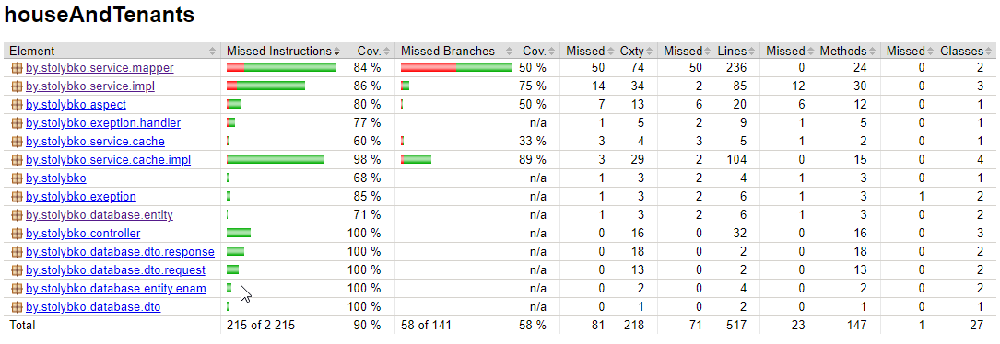
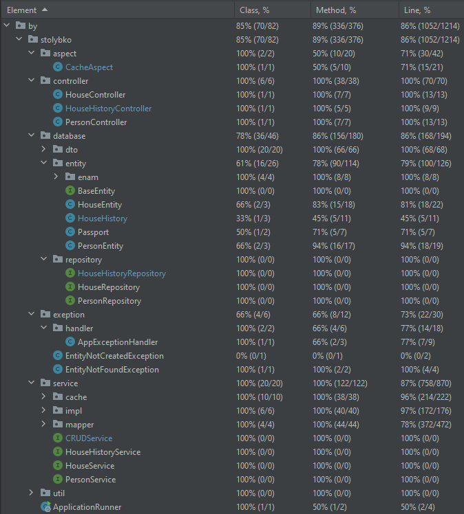

# Task - Hibernate

Создать Web приложение учёта домов и жильцов
Оформить MR (PR), заполнить и отправить форму
Описание:
2 сущности: House, Person
Система должна предоставлять REST API для выполнения следующих операций:
CRUD для House
В GET запросах не выводить информацию о Person
CRUD для Person
В GET запросах не выводить информацию о House
Для GET операций использовать pagination (default size: 15)

House:
У House обязаны быть поля id, uuid, area, country, city, street, number, create_date
House может иметь множество жильцов (0-n)
У House может быть множество владельцев (0-n)
create_date устанавливается один раз при создании

Person:
У Person обязаны быть id, uuid, name, surname, sex, passport_series, passport_number, create_date, update_date
Person обязан жить только в одном доме и не может быть бездомным
Person не обязан владеть хоть одним домом и может владеть множеством домов
Сочетание passport_series и passport_number уникально
sex должен быть [Male, Female]
Все связи обеспечить через id
Не возвращать id пользователям сервисов, для этого предназначено поле uuid
create_date устанавливается один раз при создании
update_date устанавливается при создании и изменяется каждый раз, когда меняется информация о Person. При этом, если запрос не изменяет информации, поле не должно обновиться

Примечание:
Ограничения и нормализацию сделать на своё усмотрение
Поля представлены для хранения в базе данных. В коде могут отличаться

Обязательно:
GET для всех Person проживающих в House
GET для всех House, владельцем которых является Person
Конфигурационный файл: application.yml
Скрипты для создания таблиц должны лежать в classpath:db/
create_date, update_date - возвращать в формате ISO-8601 (https://en.wikipedia.org/wiki/ISO_8601). Пример: 2018-08-29T06:12:15.156.
Добавить 5 домов и 10 жильцов. Один дом без жильцов и как минимум в 1 доме больше 1 владельца
Использовать репозиторий с JDBC Template для одного метода.

Дополнительно:
*Добавить миграцию
*Полнотекстовый поиск (любое текстовое поле) для House
*Полнотекстовый поиск (любое текстовое поле) для Person
**PATCH для Person и House

Application requirements
JDK version: 17 – use Streams, java.time.*, etc. where it is possible.
Application packages root: ru.clevertec.house.
Any widely-used connection pool could be used.
Spring JDBC Template should be used for data access.
Use transactions where it’s necessary.
Java Code Convention is mandatory (exception: margin size – 120 chars).
Build tool: Gradle, latest version.
Web server: Apache Tomcat.
Application container: Spring IoC. Spring Framework, the latest version.
Database: PostgreSQL, latest version.
Testing: JUnit 5.+, Mockito.
Service layer should be covered with unit tests not less than 80%.
Repository layer should be tested using integration tests with an in-memory embedded database or testcontainers.
As a mapper use Mapstruct.
Use lombok.
General requirements
Code should be clean and should not contain any “developer-purpose” constructions.
App should be designed and written with respect to OOD and SOLID principles.
Code should contain valuable comments where appropriate.
Public APIs should be documented (Javadoc).
Clear layered structure should be used with responsibilities of each application layer defined.
JSON should be used as a format of client-server communication messages.
Convenient error/exception handling mechanism should be implemented: all errors should be meaningful on backend side. Example: handle 404 error:
HTTP Status: 404
response body    
{
“errorMessage”: “Requested resource not found (uuid = f4fe3df1-22cd-49ce-a54d-86f55a7f372e)”,
“errorCode”: 40401
}
where *errorCode” is your custom code (it can be based on http status and requested resource - person or house)
Abstraction should be used everywhere to avoid code duplication.
Several configurations should be implemented (at least two - dev and prod).

Application restrictions
It is forbidden to use:
Spring Boot.
Spring Data Repositories.
Spring Data JPA.

Endpoints
---

~~~
вывод всех Person:
GET http://localhost:8080/person

вывод всех House:
GET http://localhost:8080/house

вывод Person по id:
GET http://localhost:8080/person/855dc206-46cd-4e9c-b92f-9ed887072cf3
вывод:
{
    "uuid": "855dc206-46cd-4e9c-b92f-9ed887072cf3",
    "name": "TestName1",
    "surname": "TestSurname1",
    "sex": "MALE",
    "passport": {
        "passportSeries": "SS",
        "passportNumber": "1234"
    },
    "createDate": "2024-01-14T22:26:45:023",
    "updateDate": "2024-01-14T22:26:45:023"
}

вывод House по id:
GET http://localhost:8080/house/d57da86c-1bd9-413b-9366-464c935d7008
вывод:
{
    "uuid": "d57da86c-1bd9-413b-9366-464c935d7008",
    "area": "123m2",
    "country": "Belarus",
    "city": "Gomel",
    "street": "Sovetskaya",
    "number": "25",
    "createDate": "2024-01-14T22:26:45:023"
}

создание Person:
POST http://localhost:8080/person
body:
{
    "name": "TestName11",
    "surname": "TestSurname11",
    "sex": "MALE",
    "passport": {
        "passportSeries": "S7",
        "passportNumber": "1234"
    },
    "houseUuid": "d57da86c-1bd9-413b-9366-464c935d7008"
}

создание House:
POST http://localhost:8080/house
body:
{
    "area": "125m2",
    "country": "Belarus",
    "city": "Gomel",
    "street": "Sovetskaya",
    "number": "33",
    "ownersUuid": [
        "4208483b-4133-49d2-b7b5-74baee38c9a1",
        "0d96b35f-f7d2-4b6f-a753-d43dc142e98d"
    ]
}

обновление Person:
PUT http://localhost:8080/person/4208483b-4133-49d2-b7b5-74baee38c9a1
body:
{
    "name": "TestName11+",
    "surname": "TestSurname11",
    "sex": "MALE",
    "passport": {
        "passportSeries": "S7",
        "passportNumber": "1234"
    },
    "houseUuid": "d57da86c-1bd9-413b-9366-464c935d7008"
}

обновление House:
PUT http://localhost:8080/house/198bd00f-ba22-4b6d-994f-03925803440f
body:
{
    "area": "126m2",
    "country": "Belarus",
    "city": "Gomel",
    "street": "Sovetskaya",
    "number": "33",
    "ownersUuid": [
        "4208483b-4133-49d2-b7b5-74baee38c9a1",
        "0d96b35f-f7d2-4b6f-a753-d43dc142e98d"
    ]
}

удаление Person:
DELETE http://localhost:8080/person/4208483b-4133-49d2-b7b5-74baee38c9a1

удаление House:
DELETE http://localhost:8080/person/4208483b-4133-49d2-b7b5-74baee38c9a1
~~~

UPDATE
---
Берём за основу существующее приложение и переезжаем на Spring boot 3.2.* в ветке feature/boot

- Добавляем сущность HouseHistory (id, house_id, person_id, date, type)
type [OWNER, TENANT]
- Создать свой тип данных в БД
- Хранить как enum в коде
- При смене места жительства добавляем запись в HouseHistory [type = TENANT], с текущей датой
- При смене владельца, добавляем запись в HouseHistory [type = OWNER], с текущей датой
- *Реализовать через триггер в БД
- *Если используется миграция, дописать новый changeset, а не исправлять существующие.

Добавляем методы:
- GET для получения всех Person когда-либо проживавших в доме
- GET для получения всех Person когда-либо владевших домом
- GET для получения всех House где проживал Person
- GET для получения всех House которыми когда-либо владел Person

Добавляем кэш из задания по рефлексии на сервисный слой House и Person.
Добавляем Integration тесты, чтобы кэш работал в многопоточной среде.
Делаем экзекутор на 6 потоков и параллельно вызываем сервисный слой (GET\POST\PUT\DELETE) и проверяем, что результат соответствует ожиданиям.
Используем H2 или *testcontainers

- *Добавляем swagger (OPEN API)
- ** Добавляем starter:
- **Реализовываем мультипроект
- **Реализовываем свой cache-starter (из задания по рефлексии)
- **Добавляем таску с build в mavenLocal
- **Добавляем стартер в основное приложение, через mavelLocal
- **Удаляем все классы из основного приложения

Swagger: 
http://localhost:8080/swagger-ui/index.html#/

Новые эндпойнты:
~~~
Возвращает всех Person ранее проживавших в доме с указанным UUID:
GET http://localhost:8080/history/tenants/house/{houseUuid}

Возвращает всех Person ранее владевших домом с указанным UUID
GET http://localhost:8080/history/owners/house/{houseUuid}

Возвращает все House в которых ранее проживал Person с указанным UUID
GET http://localhost:8080/history/houses/tenant/{tenantUuid}

Возвращает все House которыми ранее владел Person с указанным UUID
GET http://localhost:8080/history/houses/owner/{ownerUuid}
~~~

UPDATE
---
Берём за основу существующее приложение и покрываем его тестами на 80%, используя средства Spring для тестирования:
- testcontainers
- mockMvc

Отчёт о покрытии тестами:

